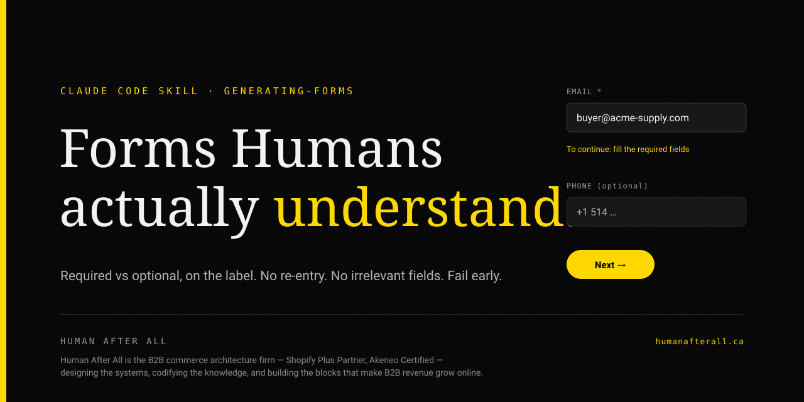

<p align="center">
  
</p>

<h1 align="center">generating-forms</h1>

<p align="center">
  A Claude Code / <a href="https://agentskills.io">Agent Skill</a> that teaches the assistant to build and audit forms<br>
  where <strong>the user always knows what to fill in, what's required, and why they can't continue</strong> —<br>
  while never asking for the same thing twice or for anything that doesn't apply.
</p>

<p align="center">
  
  
  
  
</p>

---

## Why this exists

Most "UX skills" cover visual design — palettes, typography, spacing — or broad UX frameworks. Very few cover the thing that actually makes or breaks a form: **whether the person filling it out understands it.**

A form is a conversation, not a database schema. This skill encodes the four promises a good form keeps at every moment:

- **Clarity** — required vs optional is marked on a persistent label, and a disabled button *always explains itself* (it names the exact fields still missing).
- **No redundant entry** — anything already collected or derivable is piped forward, never re-asked.
- **No irrelevant fields** — anything a prior answer makes moot is hidden or skipped.
- **Fail early** — the client validates the *same* rules as the server, so users never fill an entire form only to hit a generic error at submit.

These patterns weren't theorized — they were **extracted and hardened while building and re-auditing a production bilingual (FR/EN) legal incorporation intake form**, then generalized to be international by default (see below). Every rule in the skill traces back to a real defect a real user hit.

## The five rules

1. **Required vs optional must be unmistakable — on a persistent label — and never leave a disabled button unexplained.** A disabled button with no reason is the #1 form defect.
2. **Never ask for the same information twice — pipe it.** Prefill from what you already know; let the user confirm or edit.
3. **Never ask for what doesn't apply — progressive disclosure.** Hide fields and whole steps a prior answer made irrelevant.
4. **The client gate MUST mirror the server schema.** Validate the same formats and lengths at the field, and fail early with a field-level message.
5. **Smart defaults beat blank fields.** Pre-select the common case; keep every default editable.

## The highest-leverage pattern

Build the disabled-button hint from the **same predicate that gates the button**, so the two can never disagree:

```tsx
// Gate and hint share ONE source of truth — they can never drift apart.
const need: string[] = [];
if (!draft.companyName) need.push("Company name");
// ID formats vary by country — key the rule to the selected country, never hardcode one.
const ID_RULES: Record<string, RegExp> = {
  CA: /^\d{3}\s?\d{3}\s?\d{3}$/, // SIN
  US: /^\d{3}-?\d{2}-?\d{4}$/,   // SSN
};
const idRule = ID_RULES[draft.country];
if (idRule && !idRule.test(draft.nationalId ?? "")) need.push("ID number"); // mirrors the server regex
if (!draft.address?.postalCode) need.push("Postal code");
const valid = need.length === 0;

<button disabled={!valid}>Next →</button>
{!valid && <p className="hint">To complete: {need.join(", ")}</p>}
```

The user always knows the reason — and the reason is always the *real* one.

## International by default

Forms fail silently for foreign users when a developer hard-codes their own country. The skill treats internationalization as a correctness issue, not a nice-to-have:

- **Address autocomplete** uses an open-source geocoder ([Photon](https://photon.komoot.io) on OpenStreetMap data — no API key, no city bias) and returns the **ISO country code**, so everything downstream can be country-aware. Picking a result fills street + city + region + postal + country at once.
- **Postal / ZIP codes auto-format** to each country's canonical shape as the user types — Canada `h9b2g9` → `H9B 2G9`, US `123456789` → `12345-6789`, UK `sw1a1aa` → `SW1A 1AA`, NL `1234ab` → `1234 AB` — and the "incomplete" check keys off the country's expected length, never a hard-coded `< 5`.
- **Bank / institution pickers** suggest from a world list, not one country's banks — while still accepting any typed value.

## What's inside

```
skills/
  generating-forms/
    SKILL.md   # the skill: five rules, the disabled-button-hint pattern,
               # two-states-two-treatments, international inputs, common mistakes
assets/
    banner.svg # the header above (Human After All design system)
```

## Install

**Copy into a project (recommended):**
```bash
mkdir -p .claude/skills
cp -r skills/generating-forms .claude/skills/
```

**Or make it available to all your projects:**
```bash
cp -r skills/generating-forms ~/.claude/skills/
```

Claude Code auto-loads the skill when a request matches its `description` — building or auditing a form, deciding required vs optional, a disabled button with no explanation, prefilling, cutting fields — or invoke it explicitly with `/generating-forms`.

## Author

Built by **Rudy Abitbol**, founder of [Human After All](https://humanafterall.ca) and 18+ years in B2B eCommerce. Based in Montreal, Quebec. More at [rudyabitbol.com](https://rudyabitbol.com).

- ✍️ Substack — [b2becommerce.substack.com](https://b2becommerce.substack.com/)
- 💼 LinkedIn — [in/rudyabitbol](https://www.linkedin.com/in/rudyabitbol/)

## About Human After All

[Human After All](https://humanafterall.ca) is the B2B commerce architecture firm — a **Shopify Plus Partner** and **Akeneo Foundation Certified** — based in Montreal, Quebec. It designs the systems, codifies the knowledge, and builds the blocks that make B2B revenue grow online. Contact via [LinkedIn](https://www.linkedin.com/in/rudyabitbol/).

## License

MIT
